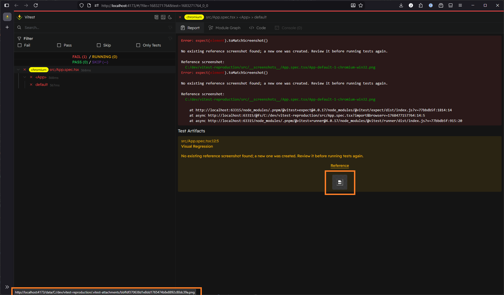

# File path error reproduction

1. Install dependencies, including playwright browsers if necessary (`npx  playwright install`)
2. Run `(p)npm test`
3. Run `(p)npm run preview`
4. Load the html report preview in the browser (`http://localhost:4173/reports/index.html`).
5. Observe the "Test Artifacts" section of the failed test result:
   
   The image path, as displayed int he bottom left of the browser, is malformed.

Note that in order to reproduce a second time the `__screenshots__` folder must be deleted.
